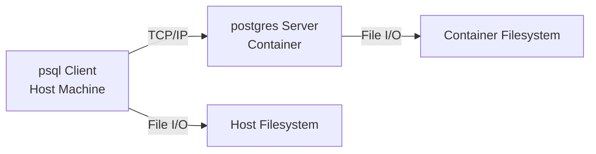

# PostgreSQL Client-Server Architecture: File Access in Containerized Environments

<blockquote className="centered-guide-block">
<div style="text-align: center">
AI WARNING <br> The content is collaborated with Claude Sonnet 4.0.<br>
A little tedious, but good enough to keep as it.
</div>
</blockquote>

## **TL;DR**
When you run `psql` on your host machine to connect to a PostgreSQL server inside a Docker/Podman container, the `\i` command looks for files on the **host filesystem**, not the container filesystem. This is because psql (the client) and postgres (the server) operate in different filesystem namespaces.

## **Problem Description**

```bash
# Host machine connection
psql -h localhost -p 5432 -d my_pg_db

# This works ✅
my_pg_db=# \i /Users/msrtea7/Private/ARCHIVE_/ENV_postgres/pg_disk/add_event.sql

# This doesn't work ❌
my_pg_db=# \i /sql/add_event.sql
# Error: /sql/add_event.sql: No such file or directory
```

But when we exec into the container:
```bash
# Container execution
podman exec -it postgres-db psql -U user -d my_pg_db

# This works ✅
my_pg_db=# \i /sql/add_event.sql

# This doesn't work ❌
my_pg_db=# \i /Users/msrtea7/Private/ARCHIVE_/ENV_postgres/pg_disk/add_event.sql
```

## **Core Architecture Understanding**

PostgreSQL follows a **client-server architecture** where:

- **Server Process (postgres)**: Manages database files and handles client connections
- **Client Application (psql)**: Connects to the server and executes database operations
- **Network Communication**: Client and server communicate via TCP/IP, even on the same machine

> **Key Insight**: As the PostgreSQL documentation states: *"files that can be accessed on a client machine might not be accessible (or might only be accessible using a different file name) on the database server machine."*

**The Two-Process Model**:


<blockquote className="centered-guide-block">
<div style="text-align: center">
graph.mermaid
</div>
</blockquote>

## **Container Filesystem Isolation**

Containers use **Linux namespaces** to create isolated environments:

- **Filesystem Namespace**: Each container has its own filesystem view
- **Network Namespace**: Containers communicate through port mapping
- **Process Namespace**: Container processes are isolated from the host

The mount command:
```bash
-v /Users/msrtea7/Private/ARCHIVE_/ENV_postgres/pg_disk:/sql
```

Creates a **bind mount** that:
- Maps host directory to container path `/sql`
- Only visible inside the container's filesystem namespace
- The host machine doesn't have a `/sql` directory

## **How `\i` Command Works**

The `\i` command performs **frontend (client-side) file operations**:

```bash
\i filename
```

**Technical Details**:
- psql reads the file from the **client's local filesystem**
- File contents are sent to the server via TCP/IP
- **No server-side file access** is involved
- File accessibility depends on the **client's user privileges**

**Execution Context Matters**:

| Execution Context | psql Location | File Access | Working Directory |
|-------------------|---------------|-------------|-------------------|
| Host Machine | Host | Host Filesystem | Host paths |
| Container | Container | Container Filesystem | Container paths |

## **Solutions and Best Practices**

### Solution 1: Host-side Execution
```bash
# Run psql on host machine
psql -h localhost -p 5432 -d my_pg_db

# Use host filesystem paths
\i /Users/msrtea7/Private/ARCHIVE_/ENV_postgres/pg_disk/add_event.sql
```

**Why it works**: psql client accesses the host filesystem directly.

### Solution 2: Container-side Execution
```bash
# Execute psql inside container
podman exec -it postgres-db psql -U user -d my_pg_db

# Use container filesystem paths
\i /sql/add_event.sql
```

**Why it works**: psql client runs in the container's filesystem namespace where `/sql` exists through volume mounting.

### Development Best Practices

1. **Consistency**: Choose one approach and stick with it
2. **Documentation**: Document which execution context your scripts expect
3. **Path Management**: Use environment variables for file paths

### Production Recommendations

```bash
# Recommended: Use absolute paths with host execution
psql -h $DB_HOST -p $DB_PORT -d $DB_NAME -f /path/to/script.sql

# Or: Use container execution with mounted volumes
docker exec -it $CONTAINER_NAME psql -U $USER -d $DB_NAME -f /scripts/script.sql
```

## **References**

- [PostgreSQL Architecture Documentation](https://www.postgresql.org/docs/current/tutorial-arch.html)
- [psql Client Documentation](https://www.postgresql.org/docs/current/app-psql.html)
- [Container Filesystem Concepts](https://docs.docker.com/storage/)

---

*This technical insight was discovered during a practical PostgreSQL containerization session, demonstrating how real-world problems often lead to deeper architectural understanding.*